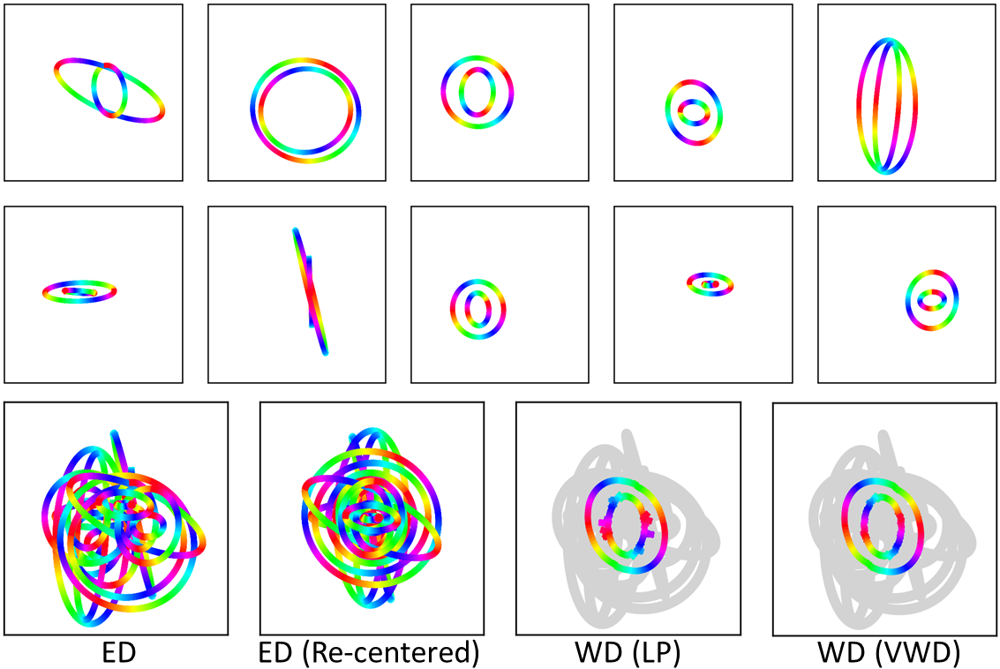

# PyVot : Python Variational Optimal Transportation
This is a collection of codes for computing semi-discrete Monge optimal transportation (OT) through the variational method.

We name our method *variational optimal transportation* (VOT) and *variational Wasserstein clustering* (VWC).

* Given the empirical distributions (marginals) and the initial centroids, 
the vinilla VWC compute OT and then update the centroids to the centers of mass.
The whole process will converge in one iteration. When there are two or more marginals, 
we compute a discrete Wasserstein barycenter, usually with free support and fixed 
measure to simplify the problem. When there are two marginals, the results can
be used to solve the optimal transshipment problem.
  
* Monge OT maps exist in general when one of the marginals are absolutely continuous. 
In practice, we consider a collection of dense Dirac samples as an approximation.
  
* Our OT formultation is convex. Yet, this program only uses the 1st order gradient
 because the 2nd order gradient involves computing convex hulls which is intractable 
 for high-dimensional data.
 
* The picture below shows 10 random nested ellipses averaged according to the 
Euclidean distance (left) and the Wasserstein distance (right). More examples 
can be found in [demo/](demo/).



## Dependencies

We implemented our method with both NumPy and PyTorch.

* Python
* NumPy
* SciPy
* Imageio
* scikit-image
* scikit-learn
* Matplotlib
* PyTorch (optional)

To use pip to install prerequisites:
```
pip install --upgrade pip
pip install -r requirements.txt
```

## References

#### Citing the package

If you find the code helpful, please cite one of the following articles:

Mi, Liang, Wen Zhang, Xianfeng Gu, and Yalin Wang. "Variational Wasserstein Clustering." In Proceedings of the European Conference on Computer Vision (ECCV), pp. 322-337. 2018.
```
@inproceedings{mi2018variational,
  title={Variational {W}asserstein Clustering},
  author={Mi, Liang and Zhang, Wen and Gu, Xianfeng and Wang, Yalin},
  booktitle={Proceedings of the European Conference on Computer Vision (ECCV)},
  pages={322--337},
  year={2018}
}
```

Mi, Liang, Wen Zhang, and Yalin Wang. "Regularized Wasserstein Means Based on Variational Transportation." arXiv preprint arXiv:1812.00338 (2018).
```
@article{mi2018regularized,
  title={Regularized Wasserstein Means Based on Variational Transportation},
  author={Mi, Liang and Zhang, Wen and Wang, Yalin},
  journal={arXiv preprint arXiv:1812.00338},
  year={2018}
}
```

Mi, Liang, Tianshu Yu, José Bento, Wen Zhang, Baoxin Li, and Yalin Wang, “Variational Wasserstein Barycenters for Geometric Clustering” arXiv preprint arXiv:2002.10543 (2020). 
```
@article{mi2020variational,
    title={Variational Wasserstein Barycenters for Geometric Clustering},
    author={Liang Mi and Tianshu Yu and Jose Bento and Wen Zhang and Baoxin Li and Yalin Wang},
    journal={arXiv preprint arXiv:2002.10543},
    year={2020}
}
```

#### Additional references

[1] Gu, Xianfeng, Feng Luo, Jian Sun, and S-T. Yau. "[Variational principles for Minkowski type problems, discrete optimal transport, and discrete Monge-Ampere equations.](https://arxiv.org/abs/1302.5472)" arXiv preprint arXiv:1302.5472 (2013).

[2] Mi, Liang, Wen Zhang, Xianfeng Gu, and Yalin Wang. "[Variational Wasserstein Clustering.](https://arxiv.org/abs/1806.09045)" In Proceedings of the European Conference on Computer Vision (ECCV), pp. 322-337. 2018.

[3] Mi, Liang, Wen Zhang, and Yalin Wang. "[Regularized Wasserstein Means Based on Variational Transportation.](http://arxiv.org/abs/1812.00338)" arXiv preprint arXiv:1812.00338 (2018).

[4] Mi, Liang, Tianshu Yu, José Bento, Wen Zhang, Baoxin Li, and Yalin Wang, “[Variational Wasserstein Barycenters for Geometric Clustering](http://arxiv.org/abs/2002.10543)”. arXiv preprint arXiv:2002.10543 (2020).

## Contact

Please contact Liang Mi icemiliang@gmail.com for any issues. Pull requests and issues are welcome.
