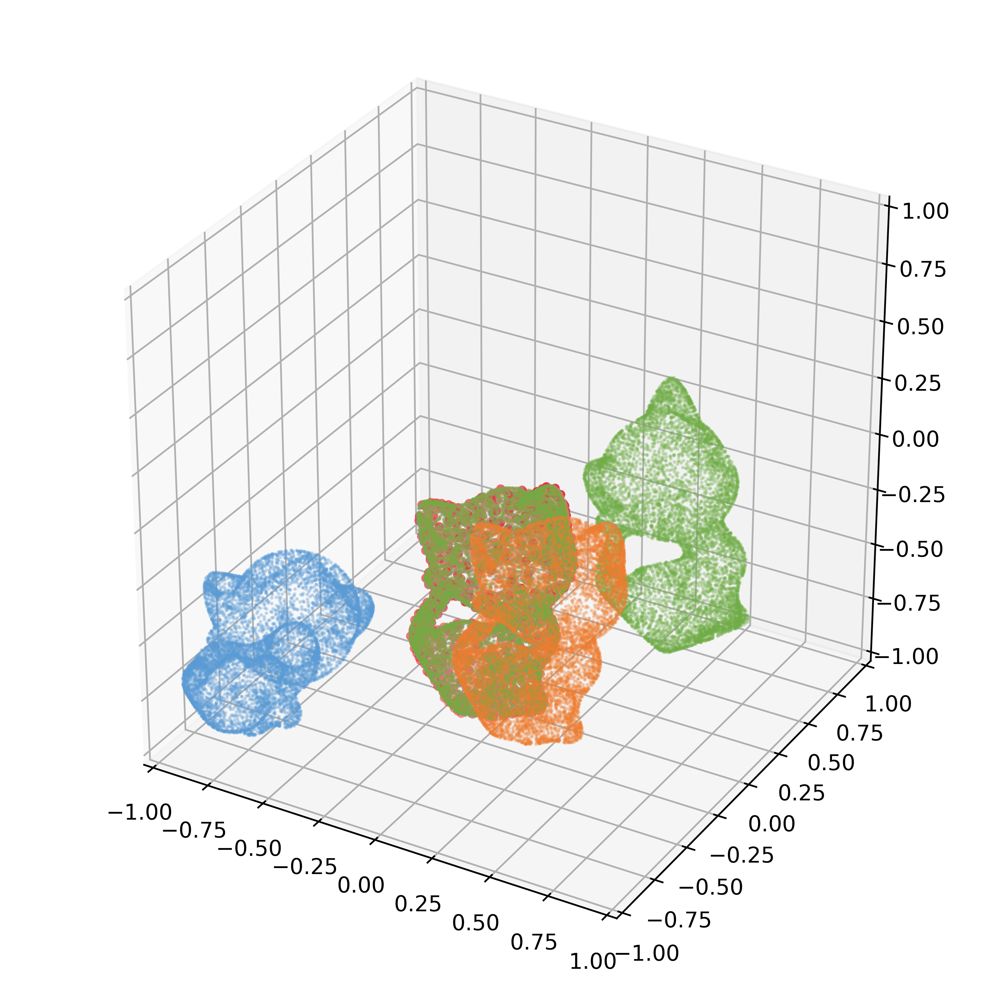
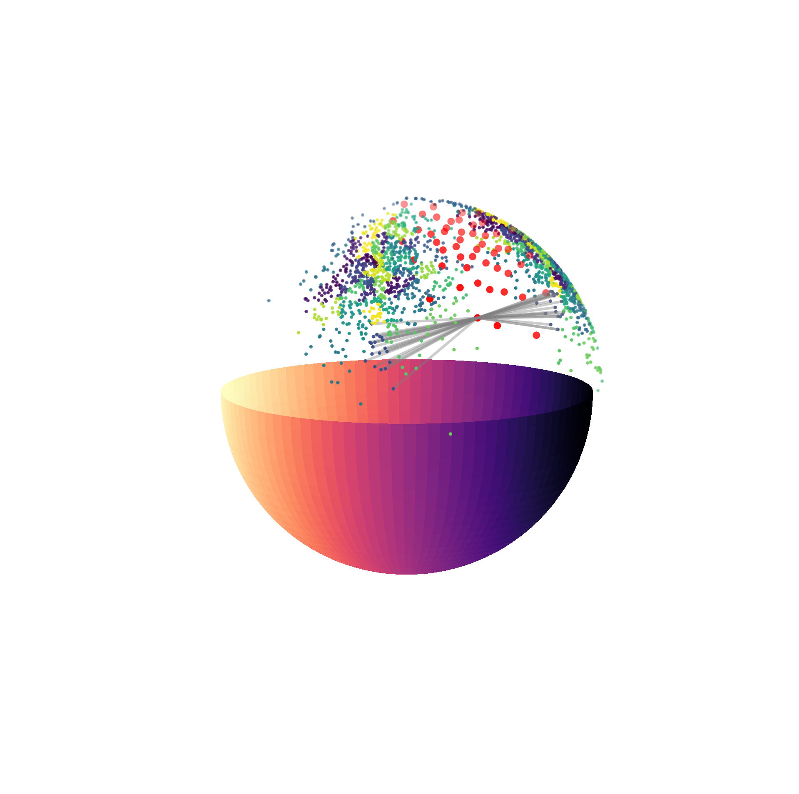
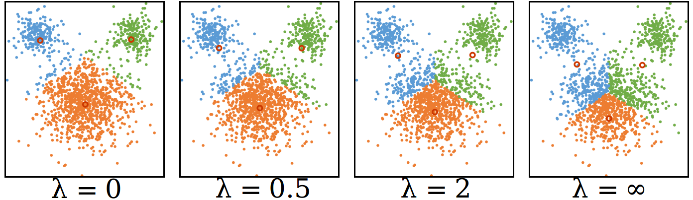
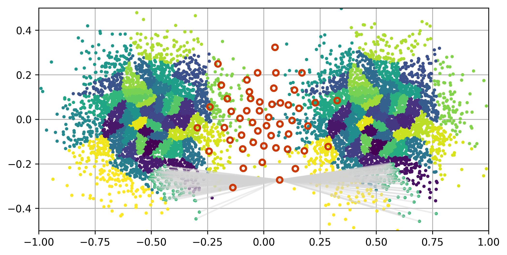
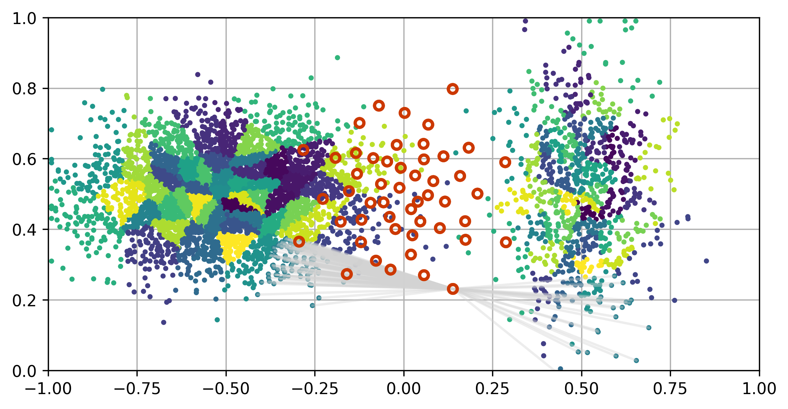
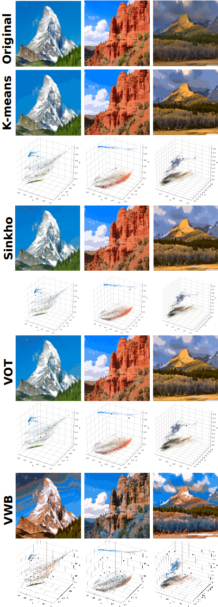

## Demo

Below shows some examples of using PyVot.

#### Double Rings
[rings_numpy.py](rings/rings_numpy.py)

#### Point Set Registration
[icp_numpy.py](icp/icp_numpy.py)

#### Spherical Transshipment
[sphere_numpy.py](sphere/sphere_numpy.py)

#### Regularized K-means
[kmeans_numpy.py](kmeans/kmeans_numpy.py)

#### Transshipment
[unbalanced_numpy.py](ship/ship_numpy.py)

#### Unbalanced Transshipment
[unbalanced_numpy.py](unbalanced2/unbalanced2_numpy.py)

#### VOT vs Sinkhorn
python vot_vs_sinkhorn.py

To run Sinkhorn OT, please install the [Python Optimal Transport](https://github.com/rflamary/POT) library, by e.g. pip install POT, 

[vot_vs_sinkhorn.py](vsSinkhorn/vot_vs_sinkhorn.py)

#### Area preserving mapping. 

[area_numpy.py](area/area_numpy.py)

#### Regularizing VOT by pair-wise similarities.

[area_numpy.py](regVOT/potential_numpy.py)

#### Regularizing VOT by global invariances.

[area_numpy.py](regVOT/transform_numpy.py)

#### Vector Quantization
[color_numpy.py](color/color_numpy.py)
