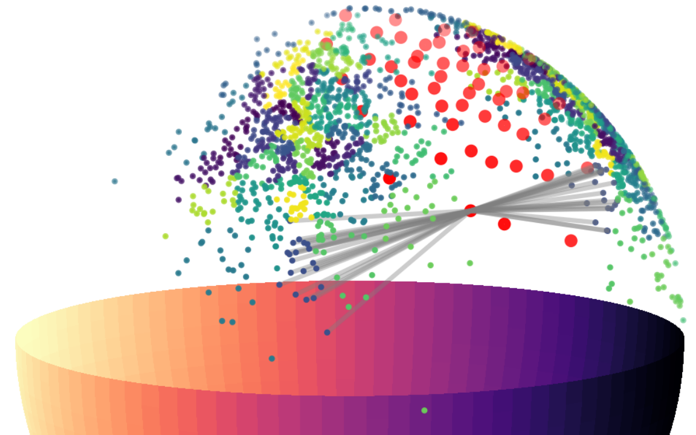
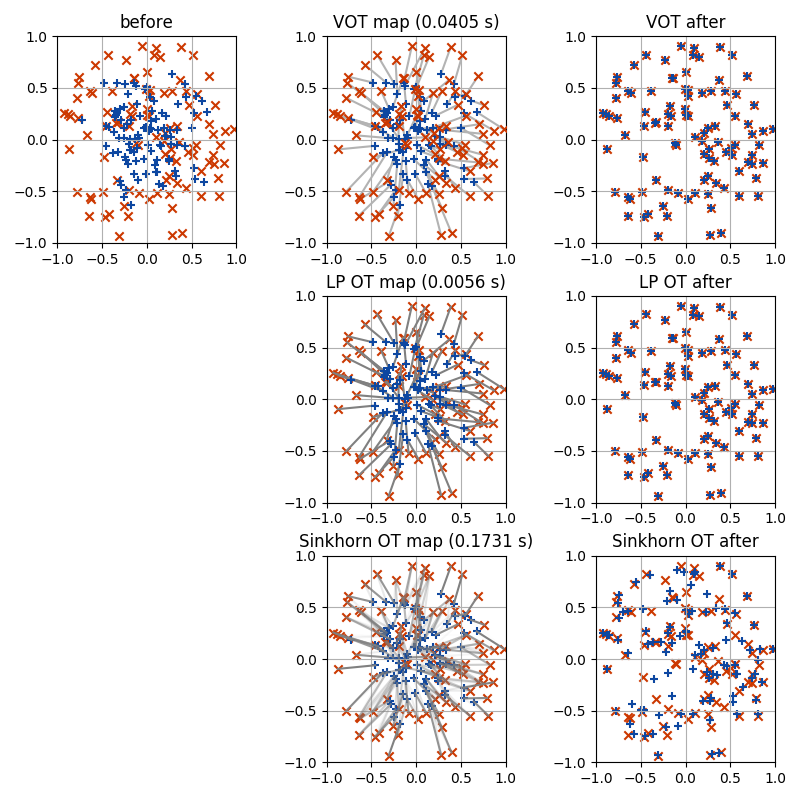
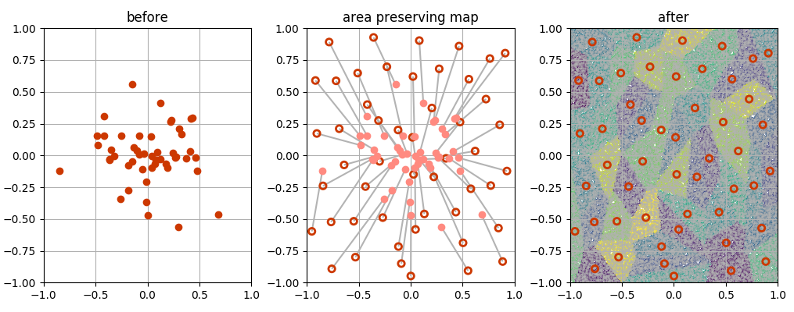
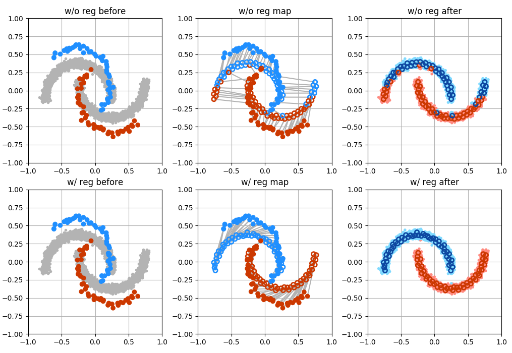

## Demo

Below shows some examples of using PyVot.

#### Double Rings

[rings_numpy.py](rings/rings_numpy.py)

#### Point Set Registration

[icp_numpy.py](icp/icp_numpy.py)

#### Spherical Transshipment

[sphere_numpy.py](sphere/sphere_numpy.py)

#### Regularized K-means

[kmeans_numpy.py](kmeans/kmeans_numpy.py)

#### Transshipment

[unbalanced_numpy.py](ship/ship_numpy.py)

#### Unbalanced Transshipment

[unbalanced_numpy.py](unbalanced2/unbalanced2_numpy.py)

#### VOT vs Sinkhorn

python vot_vs_sinkhorn.py

To run Sinkhorn OT, please install the [Python Optimal Transport](https://github.com/rflamary/POT) library, by e.g. pip install POT, 

[vot_vs_sinkhorn.py](vsSinkhorn/vot_vs_sinkhorn.py)

#### Area preserving mapping. 

[area_numpy.py](area/area_numpy.py)

#### Regularizing VOT by pair-wise similarities.

[area_numpy.py](regVOT/potential_numpy.py)

#### Regularizing VOT by global invariances.

[area_numpy.py](regVOT/transform_numpy.py)

#### Vector Quantization

[color_numpy.py](color/color_numpy.py)

